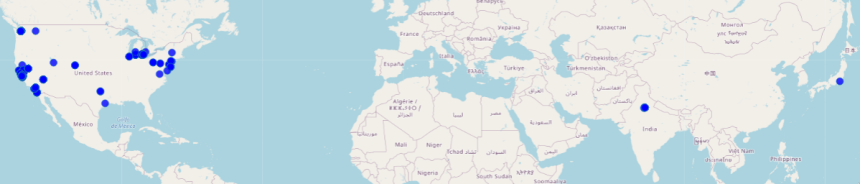

## dashboard

Not really a dashboard yet, will be eventually.

This has some of the analysis/visualizations done using data from my [HPI](https://github.com/seanbreckenridge/HPI)



## Setup

I doubt anyone else would be installing this directly as its quite personal/based on my setup. As is with my HPI, its up here as reference.

```bash
# clone and cd into this directory
pip instal -e .
```
